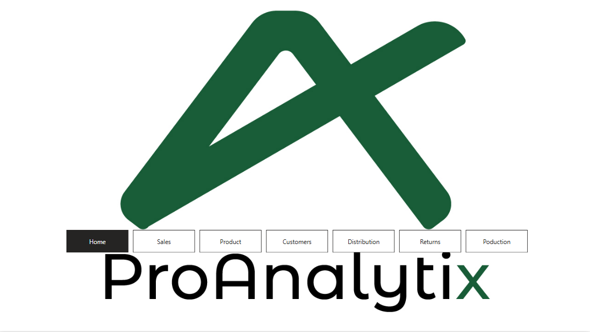
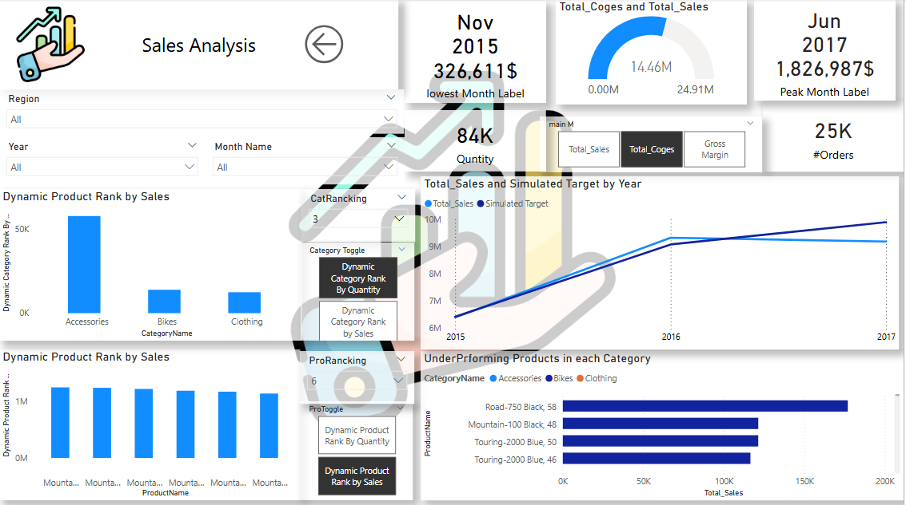
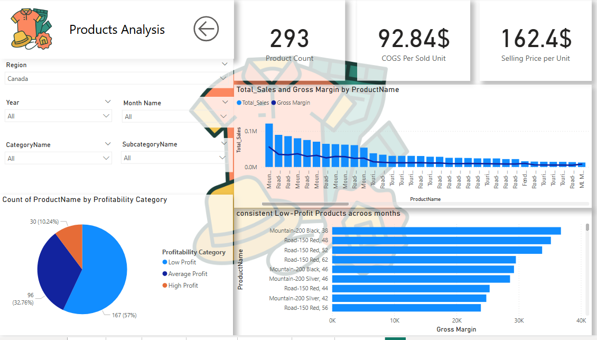
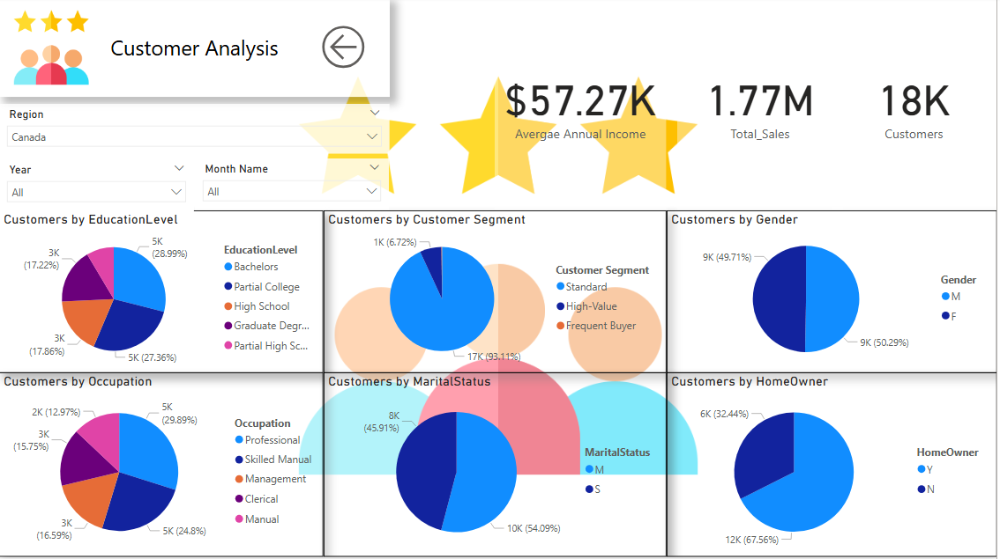
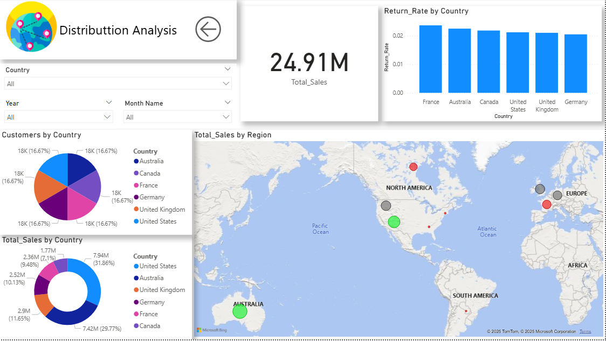
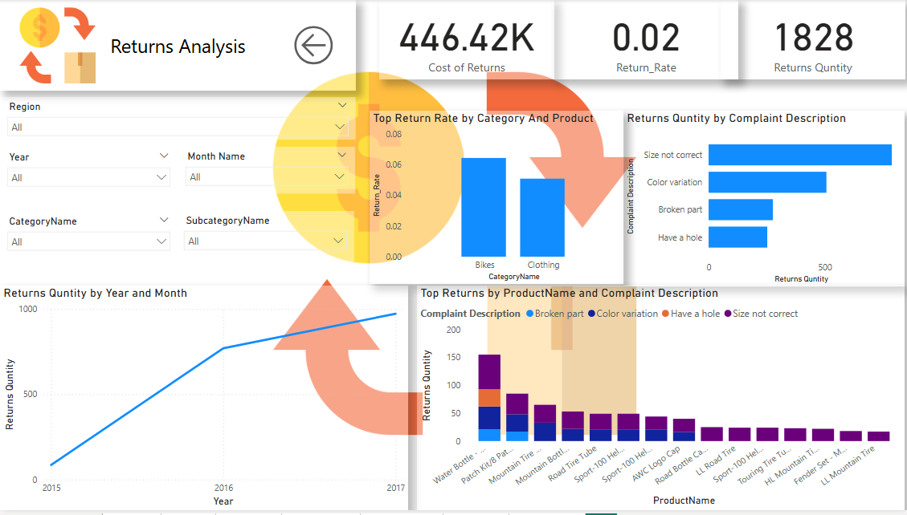
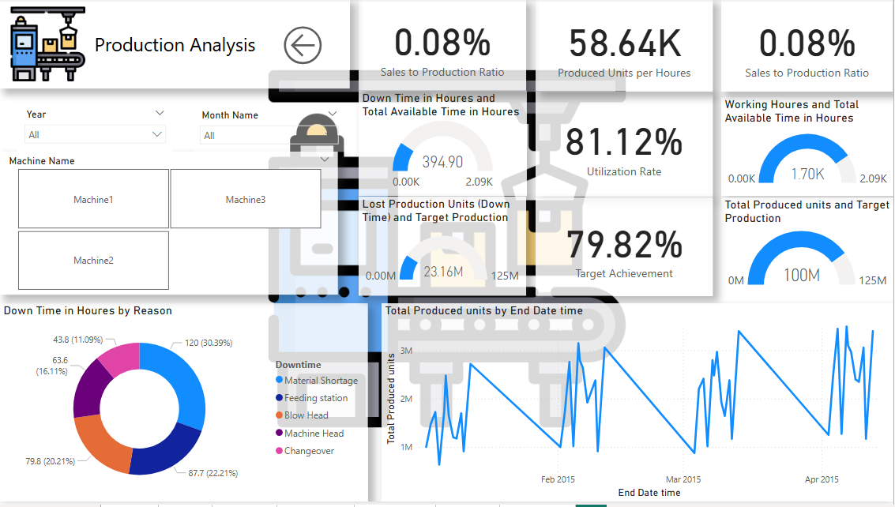

# Integrated-Business-Performance-Dashboard
"Advanced Power BI dashboard analyzing AdventureWorks data across sales, product profitability, and production efficiency. Built using  DAX, and Power BI features like  field parameters, and conditional formatting to deliver actionable insights for business stakeholders."
# 📊 Integrated Business Performance Dashboard – AdventureWorks Analysis

داشبورد تفاعلي متكامل باستخدام Power BI لتحليل بيانات AdventureWorks، يهدف إلى تقديم رؤى قابلة للتنفيذ حول أداء المبيعات، ربحية المنتجات، وكفاءة الإنتاج. تم تطوير المشروع باستخدام SQL وDAX، ويعتمد على ميزات Power BI المتقدمة مثل Drillthrough، Field Parameters، والتنسيق الشرطي.

---

## 🛠️ الأدوات والتقنيات المستخدمة
- Microsoft Power BI Desktop
- SQL Server (AdventureWorks Database)
- DAX (Data Analysis Expressions)
- Power Query
- Field Parameters
- Conditional Formatting
- Drillthrough & Hierarchical Drilldowns

---

## 🎯 أهداف المشروع
- تحليل الأداء الزمني للمبيعات (شهري، ربع سنوي، سنوي)
- تقييم ربحية المنتجات وتحديد المنتجات ذات الأداء الضعيف
- تحليل كفاءة الإنتاج واستخدام الآلات
- تقديم رؤى مرئية تساعد أصحاب القرار في تحسين العمليات

---

## 📂 محتويات المشروع
- `Power Bi Final Task.pbix`: ملف Power BI يحتوي على الداشبورد الكامل
- `Power Bi Final Task Requirments.pdf`: ملف المتطلبات التفصيلية للمشروع
- صور المعاينة:
  - `Capture1.PNG` – نظرة عامة على المبيعات
  - `Capture2.PNG` – تحليل المنتجات
  - `Capture3.PNG` – تحليل الإنتاج
  - `Capture4.PNG` – تحليل المرتجعات
  - `Capture5.PNG` – تحليل الشكاوى
  - `Capture6.PNG` – مؤشرات الأداء الرئيسية (KPIs)
  - `Capture7.PNG` – صفحة Drillthrough

---

## 📷 معاينة الداشبورد

### نظرة عامة على المبيعات

### تحليل المنتجات

### كفاءة الإنتاج

### المرتجعات والشكاوى
  

### مؤشرات الأداء الرئيسية

### Drillthrough – تفاصيل المنتج

---

## 📌 ميزات Power BI المطبقة
- **Drillthrough Pages**: لتحليل تفاصيل المنتجات والعملاء والآلات
- **Field Parameters**: لتغيير المقاييس والأبعاد ديناميكيًا (مثل Top N، المقاييس المالية، المناطق)
- **Conditional Formatting**: لتسليط الضوء على الأداء العالي والمنخفض
- **Interactive Slicers & Tooltips**: لتجربة مستخدم سلسة وتحليلات مرنة
- **Data Storytelling**: تصميم متسلسل يبدأ من الرؤية العامة وينتقل للتفاصيل

---

## 👨‍💻 المؤلف
**Mo (Muhammad Emad Ahmed)**  
Data Analyst | Power BI • DAX 

---

